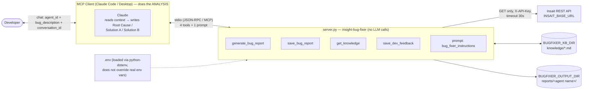
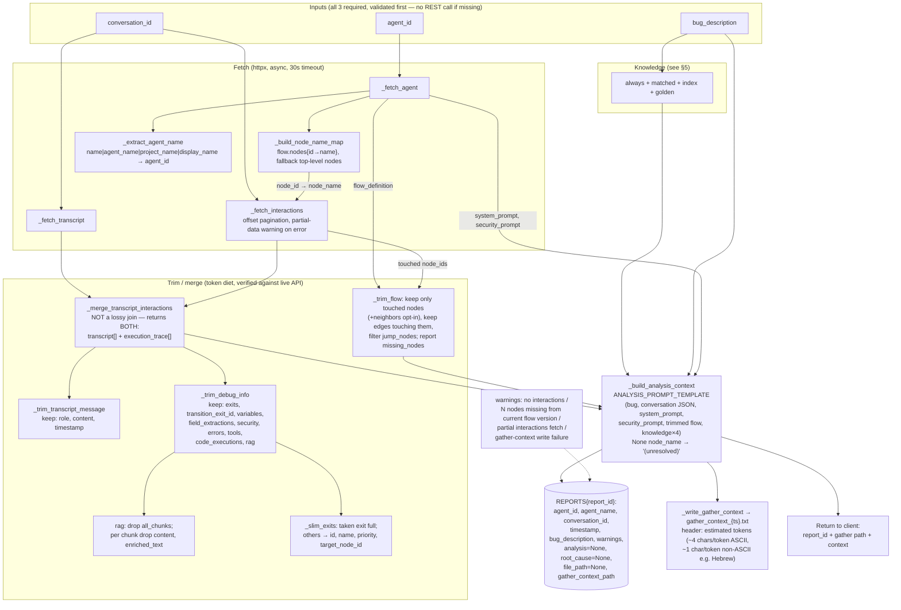
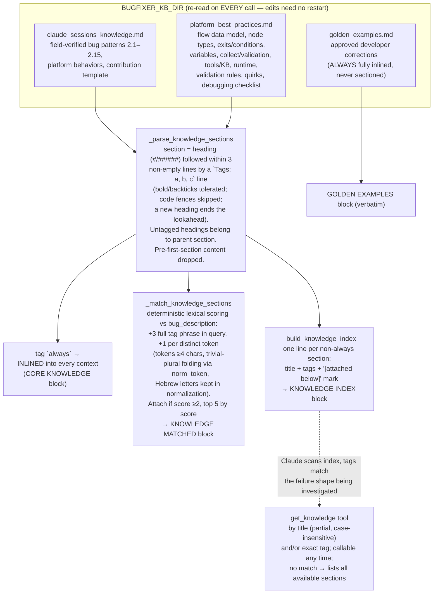
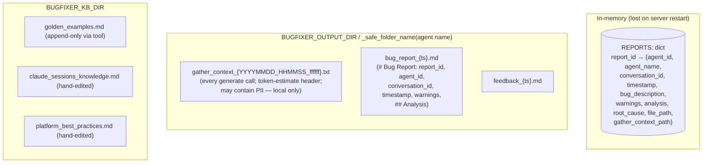

# Architecture — Insait Bug Fixer MCP

> Generated from the actual source (`server.py` @ commit `64bfeda`). Every box/arrow maps to a real function, file, or endpoint.

## Summary

| Aspect | Value |
|---|---|
| Type | MCP server (stdio transport), single file `server.py` |
| Design | **Data provider** — never calls an LLM; the MCP client (Claude) does the analysis |
| Server name | `insight-bug-fixer` (registered in `.mcp.json`, runs via `.venv/bin/python server.py`) |
| Tools | `generate_bug_report`, `save_bug_report`, `get_knowledge`, `save_dev_feedback` |
| Prompts | 1 MCP prompt: `bug_fixer_instructions` (session-start instructions) |
| External calls | 3 read-only GETs to Insait REST API (`X-API-Key` auth, 30s timeout) |
| State | In-memory `REPORTS` dict (per-process, keyed by `report_id`) |
| Persistence | Local files only: reports + gather contexts + feedback under `BUGFIXER_OUTPUT_DIR/<agent name>/`, knowledge under `BUGFIXER_KB_DIR` |
| Dependencies | `mcp`, `httpx`, `python-dotenv` (requirements.txt) |
| Config | `.env` next to `server.py`: `INSAIT_API_KEY`, `INSAIT_BASE_URL` (default `https://api-platform.insait.io`), `BUGFIXER_OUTPUT_DIR`, `BUGFIXER_KB_DIR` |

## 1. System context



**Key invariant:** the server is read-only toward the Insait platform (3 GET endpoints, nothing else) and write-only toward the local filesystem.

## 2. Insait REST endpoints used

| Step | Function | Endpoint | Notes |
|---|---|---|---|
| 2 | `_fetch_agent` | `GET /api/v1/agents/{agent_id}` | Yields `system_prompt`, `security_prompt`, `flow_definition`, `organization_id`, agent name. 404 → "Agent ID not found" |
| 3 | `_fetch_transcript` | `GET /api/v1/conversations/{conversation_id}/transcript?include_tools=true&format=json` | Single call, no pagination; served as a file download, parsed as JSON. 404 → "Conversation ID not found" |
| 4 | `_fetch_interactions` | `GET /api/v1/chat/conversations/{conversation_id}/interactions?organization_id&offset&include_debug=true` | Paginated by incrementing `offset`; stops on empty/short page; safety cap `MAX_INTERACTION_PAGES=1000`; on mid-loop error keeps partial data + warning (never fails silently) |

## 3. Main flow — gather → analyze → save → (optional) correct

```mermaid
sequenceDiagram
    participant D as Developer
    participant C as Claude (MCP client)
    participant S as server.py
    participant API as Insait REST API
    participant FS as Local filesystem

    D->>C: bug: agent_id + description + conversation_id
    Note over C: Must have all 3 inputs<br/>(per bug_fixer_instructions) — else ask
    C->>S: generate_bug_report(agent_id, bug_description, conversation_id)
    S->>S: Step 1: _first_missing() input validation
    S->>API: Step 2: GET /agents/{id}
    API-->>S: agent config (prompts, flow_definition, org_id)
    S->>S: _build_node_name_map(), _extract_agent_name()
    S->>API: Step 3: GET /conversations/{id}/transcript
    API-->>S: transcript JSON
    S->>API: Step 4: GET .../interactions (offset loop, ≤1000 pages)
    API-->>S: interaction pages (node_id → node_name enriched)
    S->>S: Step 5: _merge_transcript_interactions()<br/>(trim transcript + debug_info)
    S->>FS: Step 6: _load_knowledge_sections() (re-read every call)
    S->>S: _match_knowledge_sections(bug_description)<br/>_trim_flow(touched nodes)
    S->>S: Step 7: _build_analysis_context()<br/>mint report_id = agent_id_timestamp<br/>store in REPORTS dict
    S->>FS: _write_gather_context() → gather_context_{ts}.txt<br/>(always, with token estimate header; best-effort)
    S-->>C: report_id + full analysis context
    Note over C: Claude ANALYZES:<br/>Root Cause / Solution A /<br/>Solution B (only if genuinely different).<br/>May call get_knowledge for indexed sections.
    C->>S: get_knowledge(sections?, tags?) [optional, any time]
    S->>FS: re-read knowledge files
    S-->>C: full text of matching sections
    C->>S: save_bug_report(report_id, analysis)
    S->>S: lookup REPORTS[report_id]<br/>_extract_root_cause() (heuristic)
    S->>FS: Step 8: bug_report_{ts}.md<br/>(on OSError → return content inline instead)
    S-->>C: path + root-cause summary (≤300 chars)
    C-->>D: report delivered
    opt Developer says the analysis is wrong
        D->>C: correct fix explained
        C->>S: save_dev_feedback(report_id, user_correction)
        S->>FS: Step 9: append block to golden_examples.md<br/>(auto-create with header if missing)
        S->>FS: write feedback_{ts}.md (same block)
        S-->>C: "Correction saved" (feeds future analyses)
    end
```

## 4. Inside `generate_bug_report` — the data pipeline



## 5. Knowledge subsystem (sectioning, matching, on-demand)



## 6. Feedback loop (`save_dev_feedback`)

```mermaid
flowchart LR
    DEV([Developer: "the root cause was wrong,<br/>here is the real fix"]) --> SDF["save_dev_feedback(report_id, user_correction)"]
    SDF --> LOOK["REPORTS[report_id] lookup<br/>(must exist in THIS session/process)"]
    LOOK --> BLK["_build_correction_block:<br/>## [report_id] — [timestamp]<br/>Agent / Bug description /<br/>Original root cause (wrong) / Correct fix"]
    BLK --> AG["_append_golden_example →<br/>knowledge/golden_examples.md<br/>(auto-created with header if missing)"]
    BLK --> FF["_write_feedback_file →<br/>reports/&lt;agent&gt;/feedback_{ts}.md"]
    AG -.->|"inlined into every future<br/>analysis context (§5)"| LOOP(("self-improving<br/>loop"))
```

The `Original root cause (wrong)` field comes from `_extract_root_cause()` — a heuristic that captures the analysis text from the first line containing "root cause" until a line containing "solution" (falls back to the whole analysis).

## 7. State & storage



- `report_id = f"{agent_id}_{timestamp}"`; the output **folder is the agent name, not the agent_id** — which is why `save_bug_report`/`save_dev_feedback` need the in-memory registry (the path is not derivable from `report_id` alone), and why both fail with "Unknown report_id" after a server restart.
- `_safe_folder_name` replaces anything outside `[A-Za-z0-9._ -]` with `_` (empty → `unknown`).

## 8. Error handling (all errors returned as plain text to chat, never exceptions)

| Failure | Behavior |
|---|---|
| Missing/blank required input | `_first_missing` → "Missing required input: X" before any REST call |
| Agent 404 / conversation 404 | Friendly "check the id" message |
| Other HTTP error / timeout on agent or transcript | Abort with HTTP status / timeout message |
| Error mid-interactions-pagination | **Continue with partial data** + warning embedded in report |
| Conversation nodes absent from current flow version | Warning listing the missing node ids (flow changed since) |
| `bug_report` / feedback file write fails (OSError) | Return full content inline in chat as fallback |
| `gather_context` write fails | Warning only — never blocks the tool |
| Unknown `report_id` | "Run generate_bug_report in this session first" |
| `get_knowledge` no args / no match | Usage hint / list of all available sections+tags |

## 9. Repo layout

```
insait-bug-fixer-mcp/
├── server.py                      # everything: env, 3 REST fetchers, trimmers, knowledge
│                                  # engine, context builder, 4 tools, 1 prompt, stdio main()
├── knowledge/                     # BUGFIXER_KB_DIR content
│   ├── platform_best_practices.md #   Insait builder guide (tagged sections)
│   ├── claude_sessions_knowledge.md # field-verified fix patterns (tagged sections)
│   └── golden_examples.md         #   approved corrections (append target)
├── reports/                       # BUGFIXER_OUTPUT_DIR content, one folder per agent name
│   └── <agent name>/              #   gather_context_*.txt, bug_report_*.md, feedback_*.md
├── .mcp.json                      # registers insight-bug-fixer → .venv/bin/python server.py
├── .env                           # INSAIT_API_KEY, INSAIT_BASE_URL, BUGFIXER_OUTPUT_DIR, BUGFIXER_KB_DIR
├── requirements.txt               # mcp>=1.0.0, httpx>=0.27.0, python-dotenv>=1.0.0
├── README.md                      # user-facing docs
├── REDESIGN_NO_ANTHROPIC_KEY.md   # design doc for the data-provider redesign (no LLM key)
├── .github/CODEOWNERS             # @nir-meir
└── .claude/settings.local.json    # Claude Code local permissions
```

## 10. Constants worth knowing

| Constant | Value | Purpose |
|---|---|---|
| `REQUEST_TIMEOUT` | 30.0 s | all httpx calls |
| `MAX_INTERACTION_PAGES` | 1000 | pagination safety cap (no reliable has_more field) |
| `DEBUG_INFO_KEEP` | 9 fields | execution signals kept per interaction |
| `RAG_CHUNK_DROP` | `content`, `enriched_text` | strips document body from kept RAG chunks (~150KB saved) |
| `EXIT_SLIM_KEEP` | `id, name, priority, target_node_id` | non-taken exit candidates (~22KB saved) |
| `KNOWLEDGE_MATCH_MIN_SCORE / MAX_SECTIONS / MIN_TOKEN_LEN` | 2 / 5 / 4 | auto-attach thresholds |
| `TRANSCRIPT_KEEP` | `role, content, timestamp` | conversation-only transcript |
